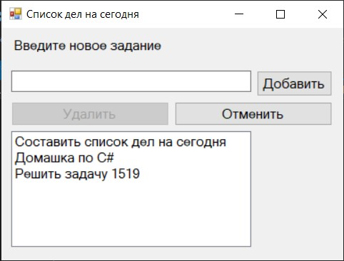

# Практики «Limited Size Stack» и «Отмена»
Репозиторий содержит решения [этой](https://ulearn.me/course/basicprogramming2/Praktika_Limited_Size_Stack__cdf76069-758c-4a3c-aacb-df3fa877cac5) и [этой](https://ulearn.me/course/basicprogramming2/Praktika_Otmena__ab3d7575-9bb1-4a4f-8d07-c1a7c2646f40) задачи с ulearn.me.
Задачи прошли код-ревью у преподавателя, за обе 50 баллов из 50. Все решения курса на максимальный балл также выложены в других репозиториях.
Ветка unsolved содержит изначальный проект.



Конечное приложение - окно с возможностью добавлять/удалять записи и отменять добавление/удаление (сохраняется история).

## Практика «Limited Size Stack»
В этой задаче вам нужно реализовать стек ограниченного размера. Этот стек работает как обычный стек, однако при превышении максимального размера удаляет самый глубокий элемент в стеке. Таким образом в стеке всегда будет ограниченное число элементов.

Вот пример работы такого стека с ограничением в 2 элемента:

```
// сначала стек пуст
stack.Push(10); // в стеке 10
stack.Push(20); // в стеке 10, 20
stack.Push(30); // в стеке 20, 30
stack.Push(40); // в стеке 30, 40
stack.Pop(); // возвращает 40, в стеке остаётся 30
stack.Pop(); // возвращает 30, стек после этого пуст
```

Операция Push должна иметь сложность O(1), то есть никак не зависеть от размера стека.

Реализуйте класс  `LimitedSizeStack`.

Отладьте его реализацию с помощью тестов в классе  `LimitedSizeStack_should`. Проверьте эффективность операции Push с помощью теста из класса  `LimitedSizeStack_PerformanceTest`.

## Практика «Отмена»
Если вы запустите проект на исполнение, то увидите окно приложения, в котором можно добавлять новые дела и удалять уже существующие. Однако кнопка "Отмена" пока не работает. Ваша задача — сделать так, чтобы эта кнопка отменяла последнее действие пользователя.

Изучите класс  `ListModel`  — в нём реализована логика работы кнопок в приложении.

Реализуйте методы  `Undo`  и  `CanUndo`. Для этого нужно хранить историю последних  `limit`  действий удаления/добавления. Используйте для этого класс  `LimitedSizeStack`  из прошлой задачи.

-   Метод  `Undo`  отменяет последнее действие из истории.
-   Метод  `CanUndo`  возвращает  `true`, если на данный момент история действий не пуста, то есть если вызов  `Undo`  будет корректным. Иначе метод должен вернуть  `false`.

Проверить корректность своего решения можно на модульных тестах из класса  `ListModel_Should`  и  `ListModel_PerformanceTest`.

Если хотите, можете воспользоваться классическим объектно-ориентированным шаблоном  [Команда](https://refactoring.guru/ru/design-patterns/command). Однако для сдачи данной задачи, точно следовать этому шаблону необязательно.
